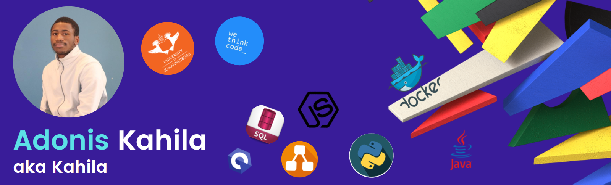

<h2>Hey! 👋</h2>

 

I'm Adonis Kahila!
<!-- - <i>Previously:</i> Full Stack Software Engineer at Zoho Corporation. -->

<h2>✨Stats</h2>

 
  

  <b><em>Overall GitHub Stats:</em></b>  
       
  <b><em>My Programming activity (Last 7 days):</em></b>  
    
  

<h2>💻 I'm Currently Learning</h2>

<!--
**Kahila/Kahila** is a ✨ _special_ ✨ repository because its `README.md` (this file) appears on your GitHub profile.

Here are some ideas to get you started:

- 🔭 I’m currently working on ...
- 🌱 I’m currently learning ...
- 👯 I’m looking to collaborate on ...
- 🤔 I’m looking for help with ...
- 💬 Ask me about ...
- 📫 How to reach me: ...
- 😄 Pronouns: ...
- ⚡ Fun fact: ...
-->
